# op-img

Image processing tools for isolating, recoloring, and destroying images.

Every script follows `<command> <input> [output] [options]`. If output is omitted, saves next to the input with a descriptive suffix.

## Quick start

Add `op` to your PATH (one-time setup from the repo root):

```bash
ln -s "$(pwd)/op" /usr/local/bin/op
```

Then use it from anywhere:

```bash
op <patch> <input> [--args]
```

```bash
op bit-crush photo.jpg                      # default 2-bit crush
op dot-halftone photo.jpg out.png --spacing 8
op closest-palette photo.jpg --palette "#000,#fff,#f00"
op                                           # list all tools
```

## Requirements

- [ImageMagick](https://imagemagick.org/) for shell scripts: `brew install imagemagick`
- [Python 3](https://www.python.org/) with Pillow and numpy for Python scripts: `pip3 install Pillow numpy scipy`

## Tools

All examples below use this image as input:

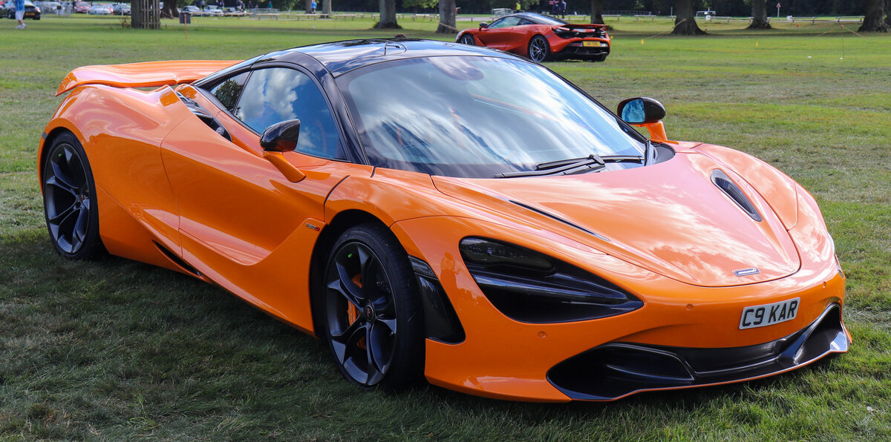

### bit-crush

Reduce color depth by posterizing to N bits per channel.

```bash
./bit-crush/bit-crush.sh <input> [output] [--bits N]
```

Default: `--bits 3` (8 color levels — 512 total colors)

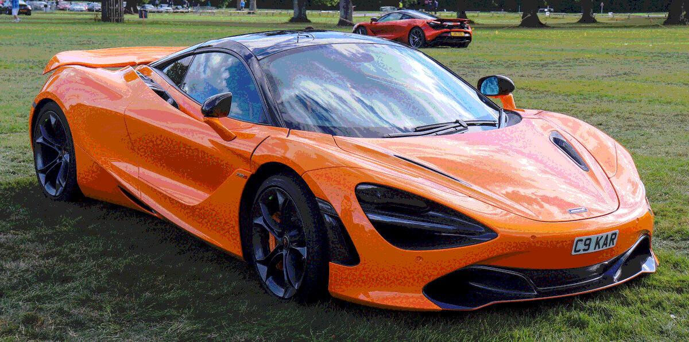

### res-crush

Downscale to a tiny resolution and upscale back with nearest-neighbor for a chunky pixel look.

```bash
./res-crush/res-crush.sh <input> [output] [--size N]
```

Default: `--size 64`

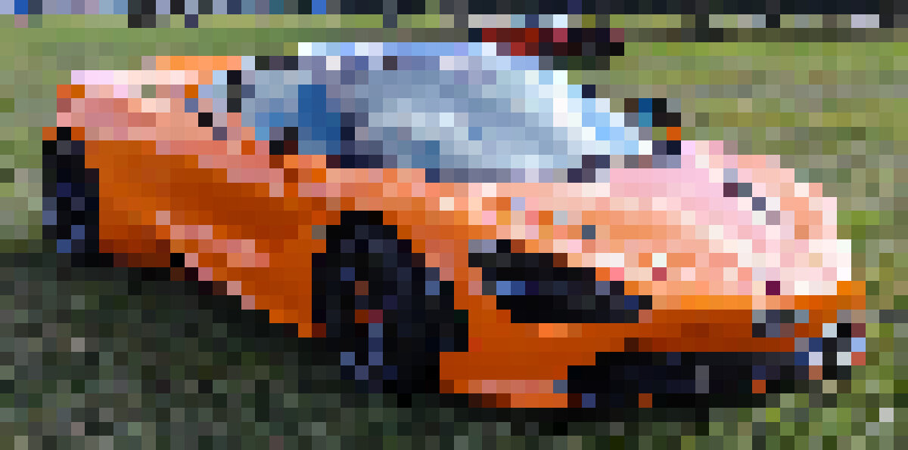

### closest-palette

Snap every pixel to its nearest color in a given palette. No dithering -- hard color boundaries.

```bash
python3 ./closest-palette/closest-palette.py <input> [output] --palette "#hex,#hex,..."
python3 ./closest-palette/closest-palette.py <input> [output] --from-image ref.png --colors N
```

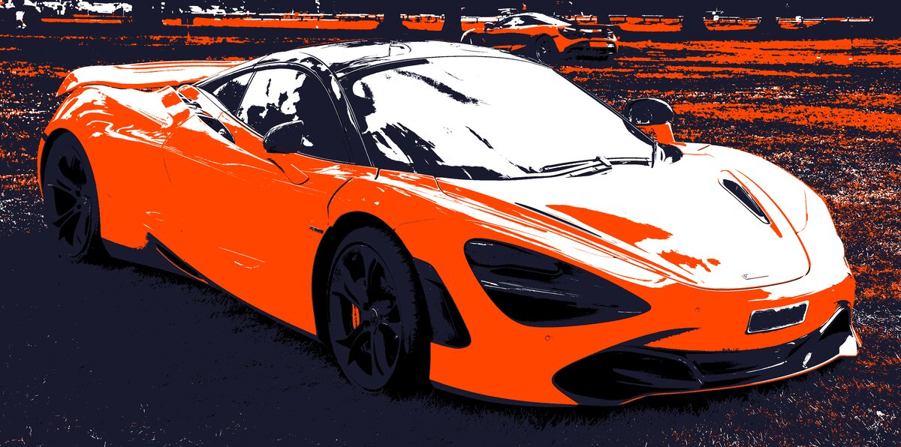

### channel-offset

Shift R, G, B channels by independent pixel amounts for a misregistered print / chromatic aberration look.

```bash
./channel-offset/channel-offset.sh <input> [output] [--r X,Y] [--g X,Y] [--b X,Y]
```

Default: `--r 30,15 --b -25,-10`

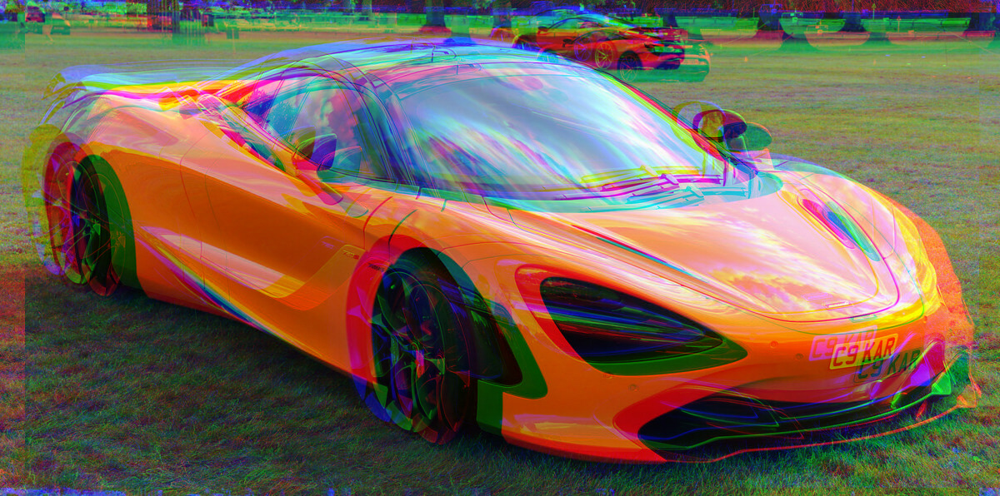

### fold

Mirror or repeat one half of the image across a fold line.

```bash
./fold/fold.sh <input> [output] [--axis x|y] [--position N] [--mode mirror|repeat]
```

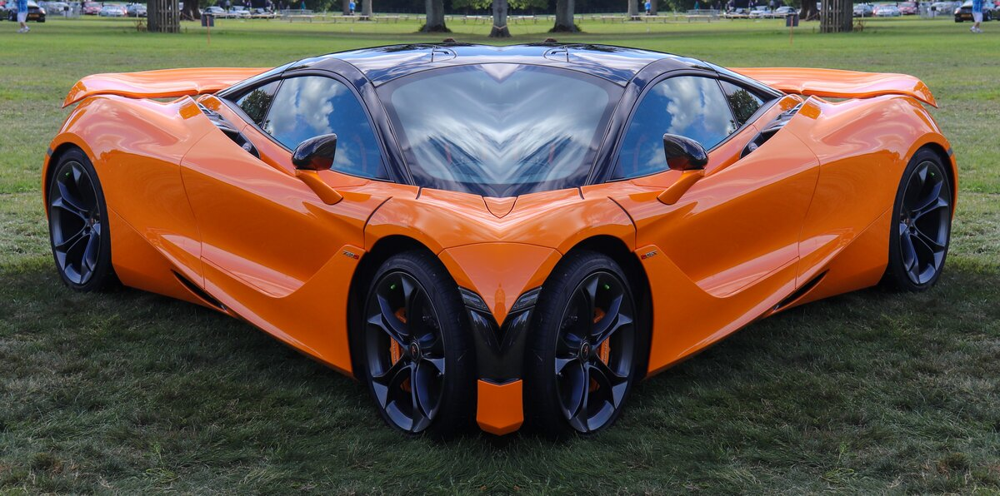

### pixel-sort

Sort contiguous runs of pixels by brightness, hue, or saturation.

```bash
python3 ./pixel-sort/pixel-sort.py <input> [output] [--by brightness|hue|saturation] [--threshold N] [--direction row|column]
```

Default: `--threshold 200`

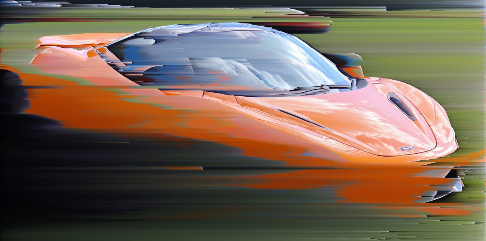

### scan-glitch

Randomly shift horizontal slices of the image for a broken-signal effect.

```bash
python3 ./scan-glitch/scan-glitch.py <input> [output] [--severity N] [--seed N]
```

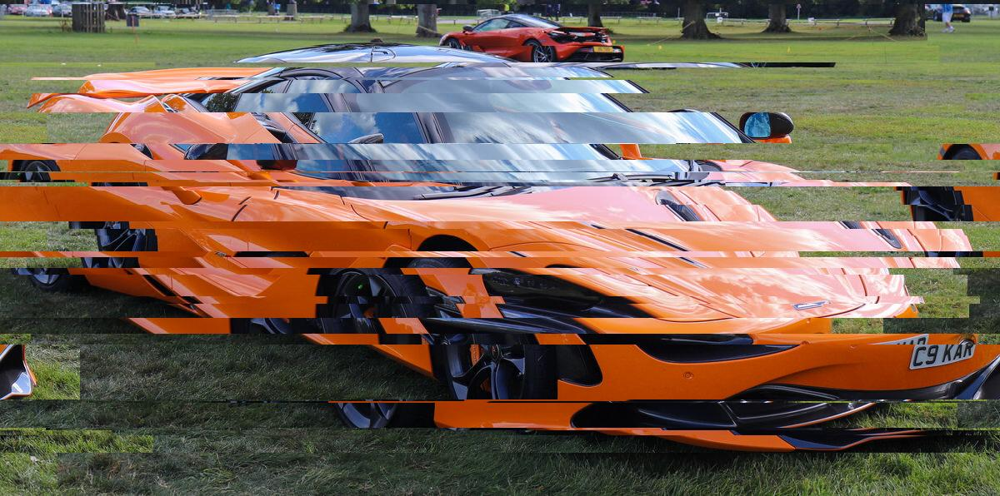

### dot-halftone

Convert to a halftone dot grid where dot size varies with brightness. Black dots on transparent background.

```bash
python3 ./dot-halftone/dot-halftone.py <input> [output] [--spacing N] [--min-dot N] [--max-dot N] [--angle N]
```

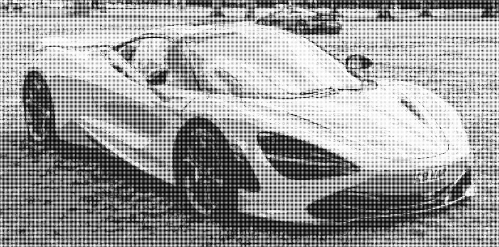

### line-halftone

Variable-width lines whose thickness maps to brightness. Black lines on transparent background.

```bash
python3 ./line-halftone/line-halftone.py <input> [output] [--spacing N] [--min-width N] [--max-width N] [--angle N]
```


### cross-hatch

Multiple line-halftone passes at different angles, each gated by a brightness threshold. Darker areas get more layers of hatching.

```bash
python3 ./cross-hatch/cross-hatch.py <input> [output] [--layers N] [--spacing N] [--thresholds N,N,N]
```

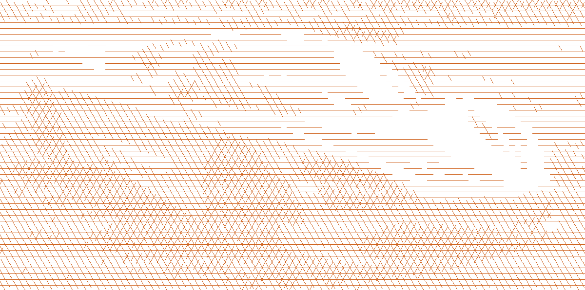

### stipple

Random dot placement where density maps to brightness. Black dots on transparent background.

```bash
python3 ./stipple/stipple.py <input> [output] [--dots N] [--dot-size N] [--seed N]
```

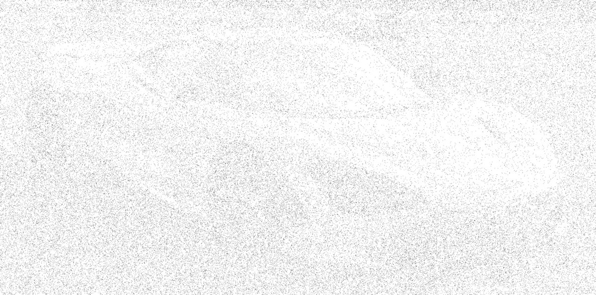


### isolate-threshold

Extract dark pixels from an image with a transparent background. Optionally recolor them and upscale with nearest-neighbor.

```bash
./isolate-threshold/isolate-threshold.sh <input> [output] [--scale N] [--threshold N] [--color "#hex"]
```

Default: `--scale 1 --threshold 50 --color "#ff0000"`

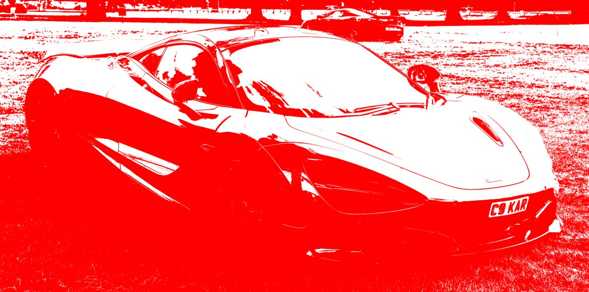

### channel-swap

Rearrange RGB channels — swap, duplicate, or reorder color channels.

```bash
python3 ./channel-swap/channel-swap.py <input> [output] [--map B,G,R]
```

Default: `--map B,G,R` (swaps red and blue)

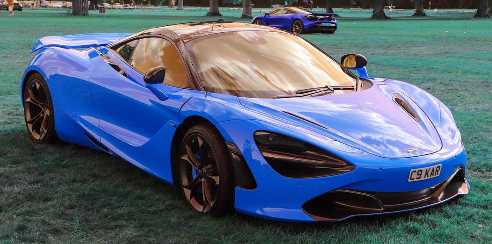

### echo

Composite the image on itself with offset and fade for a ghosting/echo effect.

```bash
python3 ./echo/echo.py <input> [output] [--count N] [--offset-x N] [--offset-y N] [--decay N]
```

Default: `--count 12 --offset-x 30 --offset-y 12 --decay 0.6 --blend additive`

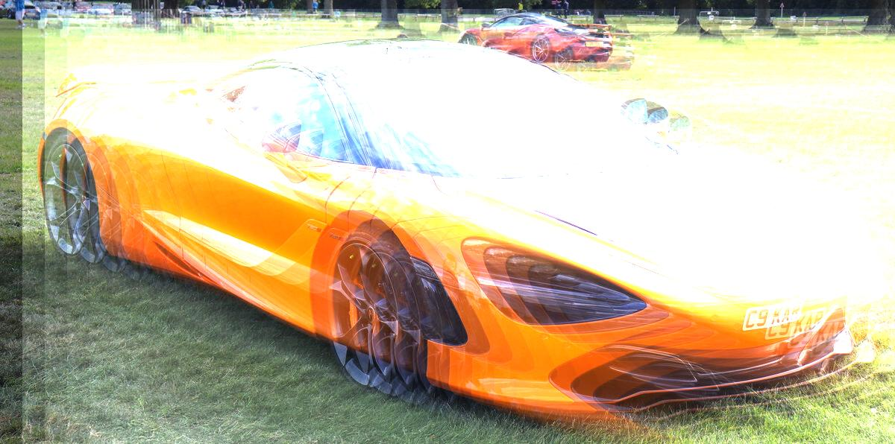

### invert-lightness

Invert the lightness channel in LAB color space — dark becomes light and vice versa, while hue and saturation are preserved.

```bash
python3 ./invert-lightness/invert-lightness.py <input> [output]
```

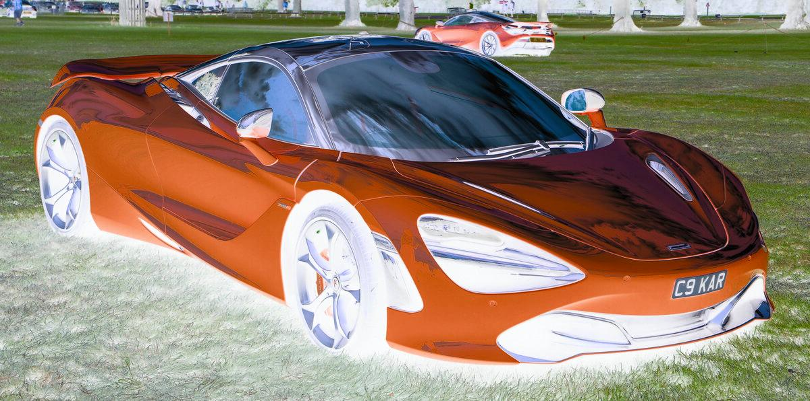

### kaleidoscope

Extract a wedge from the image and mirror/rotate it around the center for a kaleidoscope effect.

```bash
python3 ./kaleidoscope/kaleidoscope.py <input> [output] [--segments N] [--angle N]
```

Default: `--segments 6 --angle 0`

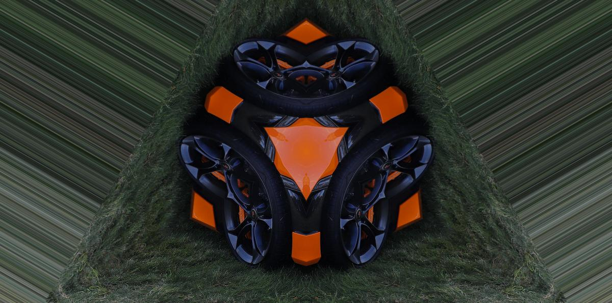

### polar

Remap image between Cartesian and polar coordinates.

```bash
python3 ./polar/polar.py <input> [output] [--mode to-polar|from-polar]
```

Default: `--mode to-polar`

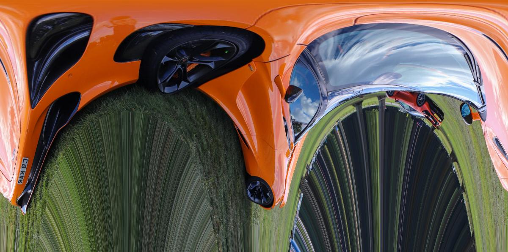

### posterize-hsv

Quantize HSV channels independently for a posterized look with hue control.

```bash
python3 ./posterize-hsv/posterize-hsv.py <input> [output] [--h-levels N] [--s-levels N] [--v-levels N]
```

Default: `--h-levels 8 --s-levels 4 --v-levels 4`

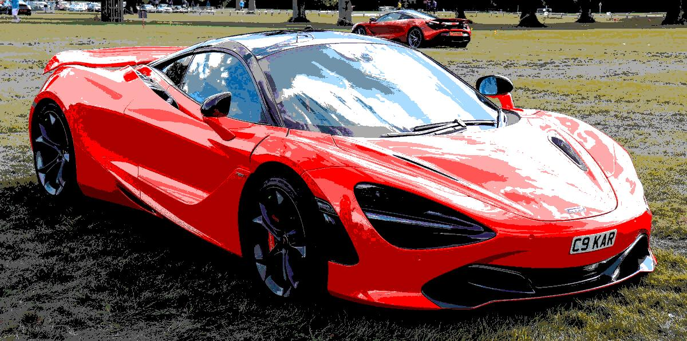

### raw-bend

Treat pixel data as a raw audio signal and apply echo, chorus, and bitcrush distortion.

```bash
python3 ./raw-bend/raw-bend.py <input> [output] [--echo-strength N] [--echo-delay N] [--chorus N] [--bitcrush N]
```

Default: `--echo-strength 0.5 --echo-delay 500 --chorus 0.3 --bitcrush 0`

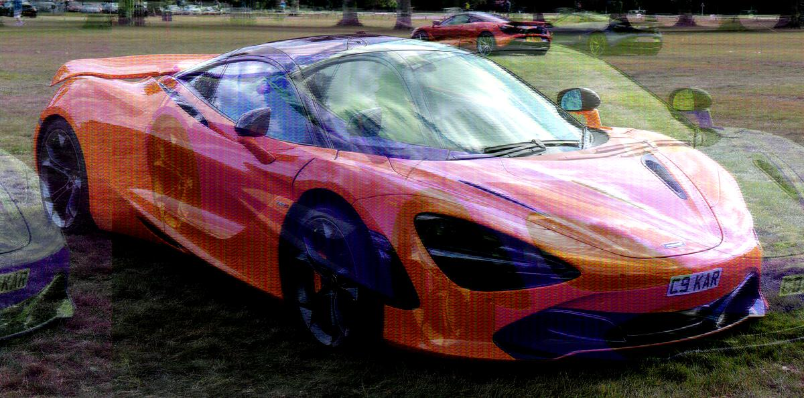

### seam-carve

Content-aware image resizing by removing low-energy vertical seams.

```bash
python3 ./seam-carve/seam-carve.py <input> [output] [--percent N] [--energy gradient|sobel]
```

Default: `--percent 35 --energy sobel`

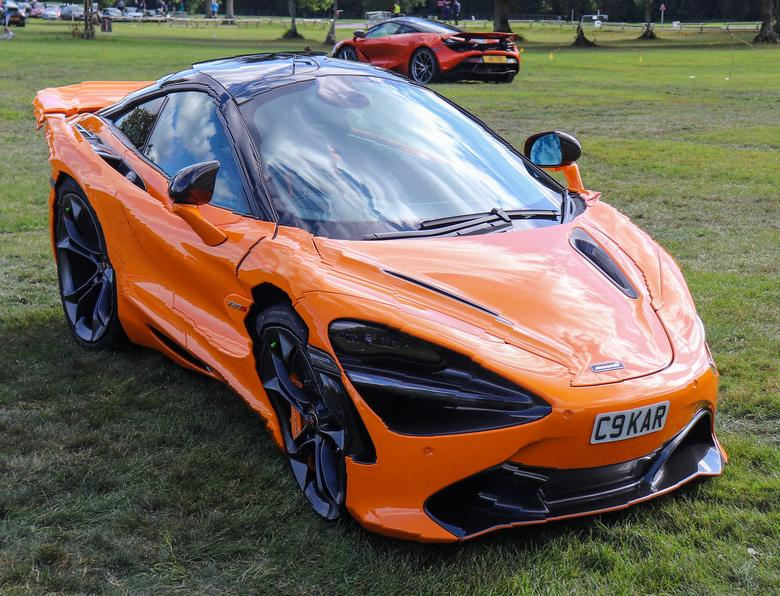

### slit-scan

Take one column from each rotation of the image and stitch them together for a slit-scan effect.

```bash
python3 ./slit-scan/slit-scan.py <input> [output] [--slits N] [--max-angle N]
```

Default: `--slits <width> --max-angle 180`

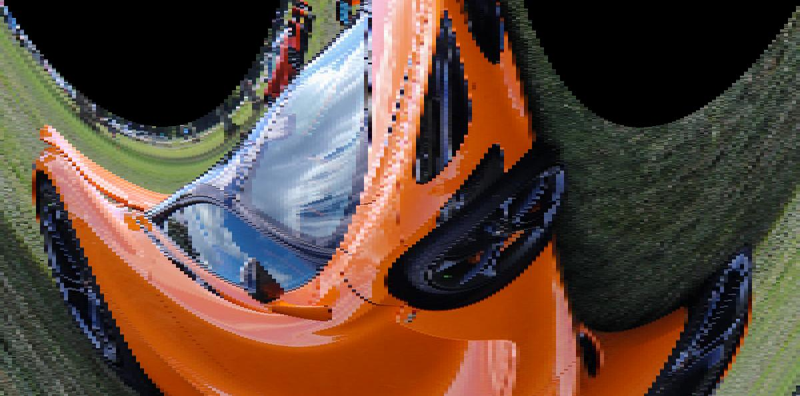

### thermal

Map brightness to a false-color thermal palette (black to blue to red to yellow to white).

```bash
python3 ./thermal/thermal.py <input> [output]
```

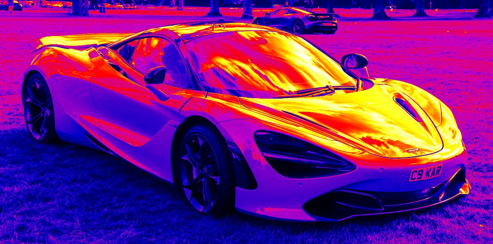

### tile-shuffle

Chop the image into an NxN grid and randomly permute the tiles.

```bash
python3 ./tile-shuffle/tile-shuffle.py <input> [output] [--grid N] [--seed N]
```

Default: `--grid 4`

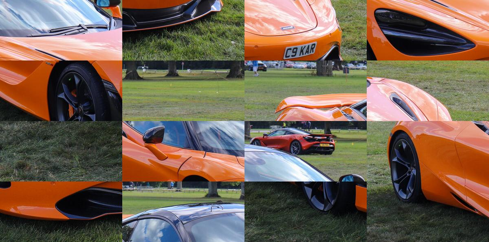

### wrong-stride

Flatten the pixel buffer and reshape with a wrong row width for a diagonal shear glitch.

```bash
python3 ./wrong-stride/wrong-stride.py <input> [output] [--offset N]
```

Default: `--offset 1`

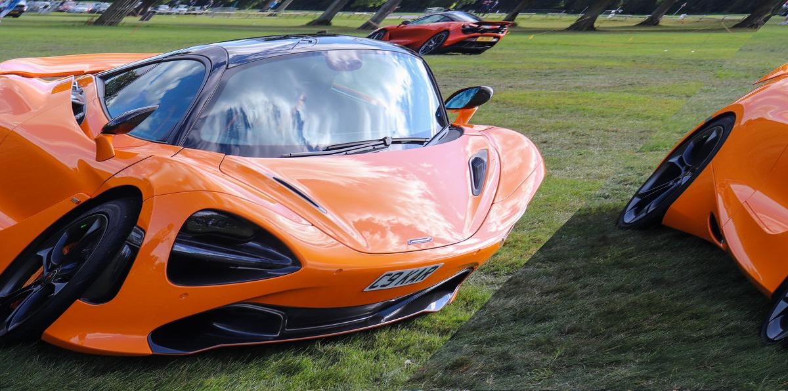
