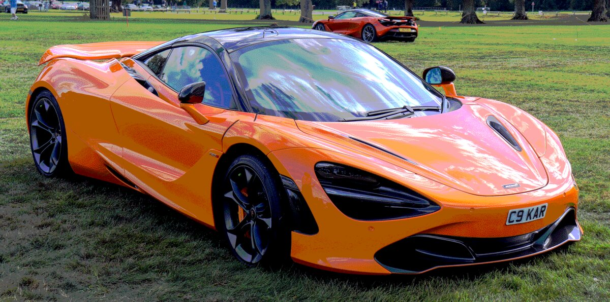
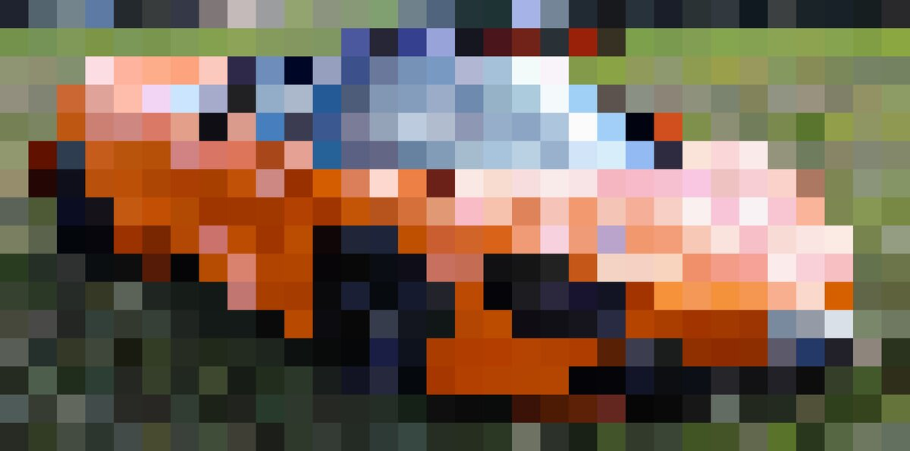

# op-img

Image processing tools for isolating, recoloring, and destroying images.

Every script follows `<command> <input> [output] [options]`. If output is omitted, saves next to the input with a descriptive suffix.

## Quick start

Add `op` to your PATH (one-time setup from the repo root):

```bash
ln -s "$(pwd)/op" /usr/local/bin/op
```

Then use it from anywhere:

```bash
op <tool> <input> [output] [--opts]
```

```bash
op bit-crush photo.jpg                      # default 2-bit crush
op dot-halftone photo.jpg out.png --spacing 8
op closest-palette photo.jpg --palette "#000,#fff,#f00"
op                                           # list all tools
```

## Requirements

- [ImageMagick](https://imagemagick.org/) for shell scripts: `brew install imagemagick`
- [Python 3](https://www.python.org/) with Pillow and numpy for Python scripts: `pip3 install Pillow numpy`

## Tools

All examples below use this image as input:


### bit-crush

Reduce color depth by posterizing to N bits per channel.

```bash
./bit-crush/bit-crush.sh <input> [output] [--bits N]
```

Default: `--bits 1` (2 color levels — 8 total colors)



### res-crush

Downscale to a tiny resolution and upscale back with nearest-neighbor for a chunky pixel look.

```bash
./res-crush/res-crush.sh <input> [output] [--size N]
```

Default: `--size 32`



### closest-palette

Snap every pixel to its nearest color in a given palette. No dithering -- hard color boundaries.

```bash
python3 ./closest-palette/closest-palette.py <input> [output] --palette "#hex,#hex,..."
python3 ./closest-palette/closest-palette.py <input> [output] --from-image ref.png --colors N
```


### channel-offset

Shift R, G, B channels by independent pixel amounts for a misregistered print / chromatic aberration look.

```bash
./channel-offset/channel-offset.sh <input> [output] [--r X,Y] [--g X,Y] [--b X,Y]
```

Default: `--r 30,15 --b -25,-10`


### fold

Mirror or repeat one half of the image across a fold line.

```bash
./fold/fold.sh <input> [output] [--axis x|y] [--position N] [--mode mirror|repeat]
```


### pixel-sort

Sort contiguous runs of pixels by brightness, hue, or saturation.

```bash
python3 ./pixel-sort/pixel-sort.py <input> [output] [--by brightness|hue|saturation] [--threshold N] [--direction row|column]
```

Default: `--threshold 200`


### scan-glitch

Randomly shift horizontal slices of the image for a broken-signal effect.

```bash
python3 ./scan-glitch/scan-glitch.py <input> [output] [--severity N] [--seed N]
```


### dot-halftone

Convert to a halftone dot grid where dot size varies with brightness. Black dots on transparent background.

```bash
python3 ./dot-halftone/dot-halftone.py <input> [output] [--spacing N] [--min-dot N] [--max-dot N] [--angle N]
```


### line-halftone

Variable-width lines whose thickness maps to brightness. Black lines on transparent background.

```bash
python3 ./line-halftone/line-halftone.py <input> [output] [--spacing N] [--min-width N] [--max-width N] [--angle N]
```


### cross-hatch

Multiple line-halftone passes at different angles, each gated by a brightness threshold. Darker areas get more layers of hatching.

```bash
python3 ./cross-hatch/cross-hatch.py <input> [output] [--layers N] [--spacing N] [--thresholds N,N,N]
```


### stipple

Random dot placement where density maps to brightness. Black dots on transparent background.

```bash
python3 ./stipple/stipple.py <input> [output] [--dots N] [--dot-size N] [--seed N]
```


### isolate-threshold

Extract dark pixels from an image with a transparent background. Optionally recolor them and upscale with nearest-neighbor.

```bash
./isolate-threshold/isolate-threshold.sh <input> [output] [--scale N] [--threshold N] [--color "#hex"]
```

Default: `--scale 1 --threshold 50 --color "#ff0000"`


